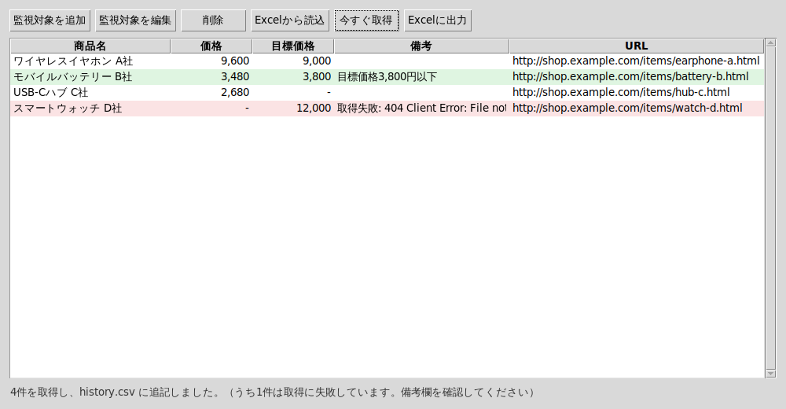

# ec-price-tracker-lite

ECサイトの商品ページから価格を取得し、CSVに履歴を蓄積する軽量スクリプトです。
「価格改定の見落ち」「毎朝の手動チェック」を自動化するための最小構成サンプルとして公開しています。

## できること

- 複数の商品ページを設定ファイル（JSON）で一括管理
- CSSセレクタで価格要素を指定して取得
- 取得結果を `history.csv` に追記（Excelでそのまま開けるUTF-8 BOM付き）
- 目標価格を設定すると、下回った行に注記を付与
- 価格推移グラフ付きのExcelレポート（.xlsx）を出力
- 監視対象をExcelテンプレートで書いて設定ファイルに変換
- GUI（コマンド操作なし）でも同じ操作が可能

## セットアップ

```bash
git clone https://github.com/syunnjack/ec-price-tracker-lite.git
cd ec-price-tracker-lite
python -m venv .venv && source .venv/bin/activate  # Windowsは .venv\Scripts\activate
pip install -r requirements.txt
```

## 使い方

```bash
cp targets.example.json targets.json  # 監視したい商品に書き換える
python main.py --config targets.json --output history.csv
```

出力例:

```
サンプル商品A	2,780円	目標価格3,000円以下
サンプル商品B	5,400円
2件を history.csv に追記しました。
```

### Excelレポートの出力

`--report` を付けると、履歴CSVから価格推移グラフ付きの `.xlsx` を生成します。

```bash
python main.py --config targets.json --output history.csv --report price_report.xlsx
```

- `価格推移` シート: 取得日時 × 商品名の表と折れ線グラフ
- `取得履歴` シート: 全取得ログ。目標価格以下の行は緑、取得失敗の行は赤で強調

既存の履歴CSVだけからレポートを作り直すこともできます。

```bash
python -c "from pathlib import Path; from report import build_report; build_report(Path('history.csv'), Path('price_report.xlsx'))"
```

### Excelテンプレートで監視対象を管理

JSONを直接編集したくない場合は、Excelに一覧で書いてから設定ファイルに変換できます。

```bash
python main.py --make-excel-template 監視対象テンプレート.xlsx  # 記入例付きのテンプレートを作成
python main.py --from-excel 監視対象テンプレート.xlsx --config targets.json  # 記入内容をJSONに変換
```

## GUI版

コマンド操作をしたくない場合や、非エンジニアのメンバーに渡す場合はGUIを使います。

```bash
python gui.py
```

- 監視対象の追加・編集・削除（`targets.json` を自動で読み書き）
- 「今すぐ取得」で価格を取得し、目標価格以下は緑・取得失敗は赤で表示
- 「Excelに出力」で `price_report.xlsx` を生成



### Windows向け実行ファイル（.exe）の作成

Pythonが入っていないPCに配布する場合は、PyInstallerで単一実行ファイルにします。

```bash
pip install pyinstaller
pyinstaller --onefile --windowed --name ec-price-tracker gui.py
```

`dist/ec-price-tracker.exe` が生成されます。`targets.json` と `history.csv` は実行時のカレントディレクトリに作られるため、exeと同じフォルダに置いて運用してください。

配布用のZip（exe・利用者向けREADME.txt・Excelテンプレート・設定例）はWindows上で次を実行するとまとめて作成できます。

```bash
python packaging/build_release.py  # dist/ec-price-tracker-gui.zip を作成（--skip-exe でexe抜きの確認も可能）
```

### 設定ファイル

| キー | 必須 | 説明 |
| --- | --- | --- |
| `name` | ○ | CSVに記録する商品名 |
| `url` | ○ | 商品ページのURL |
| `selector` | ○ | 価格が入っている要素のCSSセレクタ |
| `threshold` | - | 目標価格（円）。下回るとCSVのnote列に注記が入る |

Windowsのタスクスケジューラや cron に登録すれば、定期実行での価格履歴収集ができます。

## 注意

対象サイトの利用規約・robots.txt を確認し、過度なリクエストを行わないようにしてください。
本スクリプトは学習・検証用のサンプルです。

## 操作解説動画（YouTube・限定公開）

URL登録から価格収集、Excelレポート出力までの操作を通しで収録しています。

- https://youtu.be/LCPi8uLWCLM

## 技術解説記事（Zenn）

公開記事: https://zenn.dev/chitamaru/articles/ec-price-tracker-lite

記事本文は Zenn の連携先リポジトリ `syunnjack/zenn-content` で管理しています（Zennは1アカウント1リポジトリ連携）。このリポジトリの `articles/` は同内容の控えです。

```text
articles/ec-price-tracker-lite.md     記事本文
images/ec-price-tracker-lite/         記事に貼る画像
```

公開・非公開は記事のフロントマターで切り替えます（`published: true` にして連携先リポジトリの `main` にpushすると公開）。

ローカルでプレビューする場合:

```bash
npm install
npm run preview        # http://localhost:8000 で表示を確認
npm run new:article    # 新しい記事のひな形を作る
```

## 導入手順の詳細解説（Brain）

「非エンジニアのメンバーにも使ってもらう」ところまで含めた導入手順・運用のコツを記事にまとめています。

- Brain: [毎朝30分の「価格チェック」を1分にした話｜非エンジニアでも使える業務自動化の作り方](https://brain-market.com/u/chitamaru/a/byMzMxYjMgoTZsNWa0JXY)
- note: [導入の背景と費用対効果](https://note.com/chitamaru/n/n645cbb9768f1)

## GUI版・Excelレポート版の配布（BOOTH）

コマンド操作なしで使えるGUI版や、導入・運用の資料をBOOTHで配布しています。

| 商品 | 価格 | リンク |
| --- | --- | --- |
| Excelテンプレート集（監視対象テンプレート＋レポート見本） | 無料 | https://wangan-base.booth.pm/items/8720572 |
| CSSセレクタ調査ガイド＋導入チェックシート（PDF） | 無料 | https://wangan-base.booth.pm/items/8720637 |
| CLI版（自動実行bat・手順書つき） | ¥500 | https://wangan-base.booth.pm/items/8720631 |
| 導入・運用ガイド（PDF全11章） | ¥1,000 | https://wangan-base.booth.pm/items/8720621 |
| GUI版本体（GUI＋CLI・ソース同梱） | ¥2,500 | https://wangan-base.booth.pm/items/8714957 |

## 個別カスタマイズのご相談（ココナラ）

「対象サイトを追加したい」「Slack/メール通知を付けたい」「社内システムと連携したい」といった個別要件は、ココナラでオーダーメイド対応しています。

- ココナラ: https://coconala.com/services/2561235

## ライセンス

MIT License
